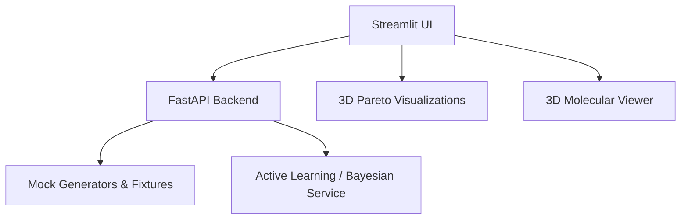

# CatalystAI

CatalystAI is an AI-powered Molecular Discovery Platform covering Chemical Catalysis and Synthetic Biology.

## MVP Architecture

## Running the MVP

1. Make sure you have Docker installed.
2. Run `docker-compose up --build`
3. Access the Streamlit Dashboard at `http://localhost:8501`
4. Access the FastAPI backend docs at `http://localhost:8000/docs`
